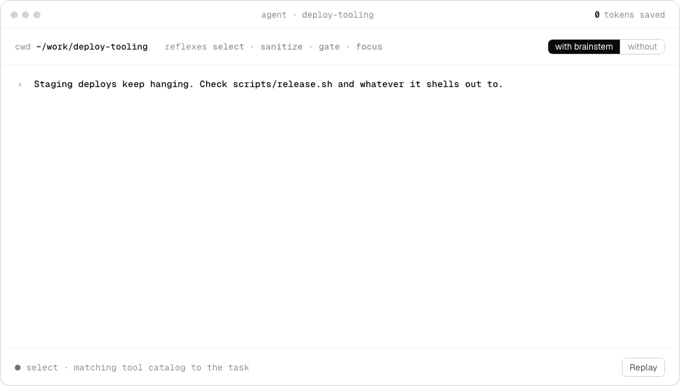

<p align="center">
  <picture>
    <source media="(prefers-color-scheme: dark)" srcset="assets/wordmark-dark.png">
    
  </picture>
</p>

<p align="center"><a href="https://brainstem.sh">brainstem.sh</a></p>

<p align="center">
  <a href="https://github.com/crc442/brainstem/actions/workflows/ci.yml"></a>
  <a href="LICENSE"></a>
</p>

Brainstem adds fast, narrow judgment checks ("reflexes") to a coding agent. Each reflex answers one question, such as "Should this tool call run?", "Is this output safe to show the model?" or "Is the agent making progress?" Judgments come from Jev, TypeSafe's System One model. Your agent still owns execution, permissions, and approvals.

## What it looks like

<picture>
  <source media="(prefers-color-scheme: dark)" srcset="assets/demo-dark.gif">
  
</picture>

A scripted replay of a real session shape, with no live API calls; token counts are illustrative.

## Install

```sh
npm install @brainstem/reflexes @brainstem/pi-adapter
```

| Package | Version | What it is |
|---|---|---|
| [`@brainstem/reflexes`](packages/reflexes) | [](https://www.npmjs.com/package/@brainstem/reflexes) | The reflexes API: `createReflexes`, `jevJudge` |
| [`@brainstem/pi-adapter`](packages/pi-adapter) | [](https://www.npmjs.com/package/@brainstem/pi-adapter) | `attachReflexes` for Pi agents |
| [`@brainstem/core`](packages/core) | [](https://www.npmjs.com/package/@brainstem/core) | The engine both depend on; installed automatically |

## Quick start

Attach reflexes to an existing [Pi](https://github.com/earendil-works/pi/tree/main/packages/agent) agent:

```ts
import { createReflexes, jevJudge } from "@brainstem/reflexes";
import { attachReflexes } from "@brainstem/pi-adapter";

const reflexes = createReflexes({ judge: jevJudge() }); // reads TYPESAFE_API_KEY

const plugin = attachReflexes(agent, reflexes, { cwd: process.cwd() });

await plugin.prompt("Fix the failing login test");
```

Gate, Sanitize, and Verify are on by default; the rest are opt-in via `modes`. Not using Pi? Call the reflexes directly from `@brainstem/reflexes` or use `createPluginSession`. See the [typechecked host example](packages/pi-adapter/examples/host-plugin.ts) for all seven wired up.

## Reflexes

| Reflex | What it does |
|---|---|
| Gate | Decides whether a tool call or incoming message runs, asks for approval, or is denied |
| Sanitize | Withholds tool output carrying injected instructions before the model sees it |
| Verify | Checks whether a tool result actually achieved what was asked |
| Pulse | Detects loops and stalled progress across tool turns |
| Steer | Routes the next step to the primary or a cheaper model |
| Select | Picks which optional tools/skills are relevant to the task |
| Focus | Cuts large output down to relevant sections (off by default) |

Literal facts (paths, counts, exit codes, budgets) are always computed in code, never delegated to a judgment.

Each reflex runs in `off`, `shadow` (judge and log, don't act), or `active` mode.

## Trust dial

`trust` (0–1) lowers the confidence bar for auto-running actions: `autoConfidence = 0.95 - 0.35 * trust` (see `packages/core/src/policy.ts`). `trust 0` does not mean "ask about everything". Safety thresholds such as deny lines and credential-access thresholds never change with trust.

## Packages

| Package | Purpose |
|---|---|
| [`@brainstem/reflexes`](packages/reflexes) | Judgment API; bring your own judge model |
| [`@brainstem/pi-adapter`](packages/pi-adapter) | Wires reflexes into a Pi agent |
| [`@brainstem/core`](packages/core) | Low-level engine, policy, and journal |
| `@brainstem/cli` | Reference host demonstrating the integration (not a sandbox) |

## Try the reference CLI

Add `TYPESAFE_API_KEY` and `ZAI_API_KEY` to `.env` (bun auto-loads it), then:

```sh
bun install
bun packages/cli/src/main.ts --cwd /tmp/repo --task "fix the failing test" --trust 0.5
bun packages/cli/src/main.ts replay <journal.ndjson> [--trust N]
```

## Development

```sh
bun run test
bun run typecheck
bun run lint
bun run build
bun run format
```

Add a changeset with `bun changeset` for changes that should ship.

The `@earendil-works/pi-*` dependencies are pinned deliberately; upgrade them explicitly.

## Docs

- [Integration guide](docs/integration/plugin.md): lifecycle, modes, approvals, output recovery, confidence, telemetry
- [Reference CLI internals](docs/cli.md): approvals, file writes, process termination, output recovery, Focus rollout, replay, answer cache

MIT licensed; see [LICENSE](LICENSE).
